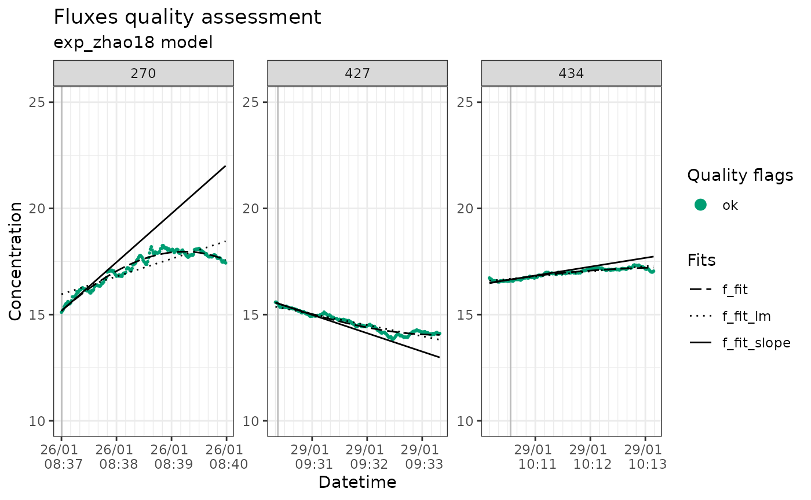

# Transforming gas concentration in volumetric units before modelling the fluxes

Gas concentration is typically measured in fractional units (e. g., ppm)
by gas analysers. When calculating the fluxes, the temperature,
pressure, and gas constant are used to transform the flux in a
volumetric concentration (e.g., mmol/l). Since the temperature might be
changing over time during the measurement, the average is usually used
in that calculation.

From `fluxible 1.4.0`, it is possible to transform each gas
concentration datapoints in volumetric units before modelling the slope,
and calculating the flux. This accounts better for temperature changes
in the chamber, typically in hot climate, but requires more temperature
measurements during the flux measurements.

This vignette is showing this pathway with a sample dataset from the
[NatuRA project](https://betweenthefjords.w.uib.no/our-research/natura/)
in the Drakensberg in South Africa. CO₂ concentration was measured every
second with an LI7810, air temperature inside the chamber also every
second, and the atmospheric pressure daily average was retrieved from a
nearby weather station.

``` r

library(tidyverse)

conc_df <- read_csv("ex_data/sample_vol_conc.csv")

head(conc_df)
#> # A tibble: 6 × 7
#>     CO2 datetime            temp_air f_start             f_fluxid
#>   <dbl> <dttm>                 <dbl> <dttm>                 <dbl>
#> 1  376. 2026-01-26 08:37:00     27.2 2026-01-26 08:37:00      270
#> 2  377. 2026-01-26 08:37:01     27.1 2026-01-26 08:37:00      270
#> 3  379. 2026-01-26 08:37:02     27.1 2026-01-26 08:37:00      270
#> 4  382. 2026-01-26 08:37:03     27.1 2026-01-26 08:37:00      270
#> 5  384. 2026-01-26 08:37:04     27.1 2026-01-26 08:37:00      270
#> 6  386. 2026-01-26 08:37:05     27.1 2026-01-26 08:37:00      270
#> # ℹ 2 more variables: f_end <dttm>, atm_press <dbl>
```

We can now transform the concentration in volumetric units with the
`flux_conc` function. Because the CO₂ was measured in ppm, the
volumetric concentration will be in µmol/l.

``` r

library(fluxible)

conc_df_vol <- flux_conc(
  conc_df,
  CO2,
  temp_air,
  atm_press
)

head(conc_df_vol)
#> # A tibble: 6 × 8
#>     CO2 datetime            temp_air f_start             f_fluxid
#>   <dbl> <dttm>                 <dbl> <dttm>                 <dbl>
#> 1  376. 2026-01-26 08:37:00     27.2 2026-01-26 08:37:00      270
#> 2  377. 2026-01-26 08:37:01     27.1 2026-01-26 08:37:00      270
#> 3  379. 2026-01-26 08:37:02     27.1 2026-01-26 08:37:00      270
#> 4  382. 2026-01-26 08:37:03     27.1 2026-01-26 08:37:00      270
#> 5  384. 2026-01-26 08:37:04     27.1 2026-01-26 08:37:00      270
#> 6  386. 2026-01-26 08:37:05     27.1 2026-01-26 08:37:00      270
#> # ℹ 3 more variables: f_end <dttm>, atm_press <dbl>, f_conc_vol <dbl>
```

Now we do the model fitting, quality check, and plotting as usual.

``` r


fit_df <- flux_fitting(
  conc_df_vol,
  f_conc_vol,
  datetime
)

quality_df <- flux_quality(
  fit_df,
  f_conc_vol,
  ambient_conc = 18, # approx ambient CO2 concentration at 20°C in umol/l
  error = 4 # this one also needs to be adapted
)

flux_plot(
  quality_df,
  f_conc_vol,
  datetime,
  f_ylim_upper = 25, # default values are for ppm
  f_ylim_lower = 10
)
```



Then we can calculate fluxes with `flux_calc`. We still input the
columns `atm_press` and `temp_air`, to get them averaged per fluxes.
They are however not used in the flux calculation since this was done
with `flux_conc` already.

``` r

fluxes <- flux_calc(
  quality_df,
  f_slope,
  datetime,
  temp_air,
  conc_unit = "umol/l", # notice the units change
  flux_unit = "umol/m2/s",
  setup_volume = 125,
  atm_pressure = atm_press,
  plot_area = 0.25,
  cut = FALSE
)

str(fluxes)
#> tibble [3 × 7] (S3: tbl_df/tbl/data.frame)
#>  $ f_fluxid          : num [1:3] 270 427 434
#>  $ f_slope           : num [1:3] 0.03818 -0.01441 0.00693
#>  $ f_temp_air_ave    : num [1:3] 28.2 27 19
#>  $ f_atm_pressure_ave: num [1:3] 0.991 0.99 0.99
#>  $ datetime          : POSIXct[1:3], format: "2026-01-26 08:37:00" "2026-01-29 09:30:20" ...
#>  $ f_flux            : num [1:3] 19.09 -7.2 3.46
#>  $ f_model           : chr [1:3] "exp_zhao18" "exp_zhao18" "exp_zhao18"
```
